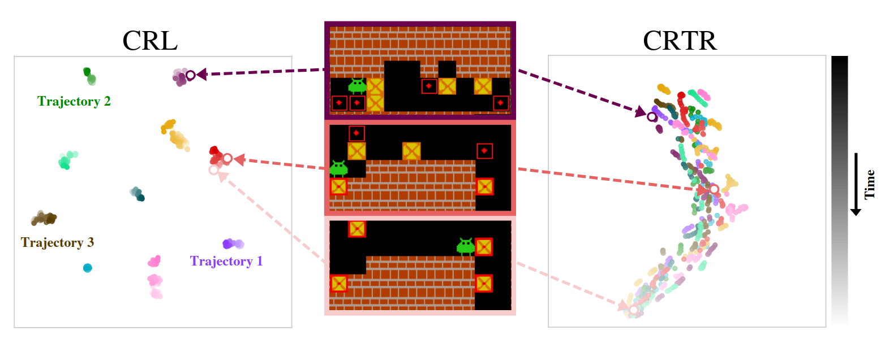

# Contrastive Representations for Temporal Reasoning

Official repository of [Contrastive Representations for Temporal Reasoning](TODO_arxiv_link) (CRTR).  

<p align="center">
  
</p>


## Installation
We recommend using Python v3.10. Set up the repository by running:
```bash
  pip install -e .
```


## Datasets
### Example datasets
The example datasets for the Rubik's Cube and Sokoban are stored in `example_datasets/{rubik/sokoban}`. You can use them to verify that the code runs correctly. To replicate the results from the paper, please download the full datasets as described below.

### Downloading Full Datasets
#### Install huggingface-cli:
```pip install -U "huggingface_hub[cli]"```
#### Install git lfs (for Ubuntu):
```bash
    sudo apt-get update
    sudo apt-get install git-lfs
    git lfs install```


### Rubik's Cube
The dataset for the Rubik's Cube requires `12GB` of available storage. Download it by running:
```bash
    huggingface-cli download oolongie/rubik_randomly_shuffled --repo-type dataset  --local-dir training_datasets/rubik
```


### Sokoban
The dataset for Sokoban requires `14GB` of available storage. Download it by running:
```bash
huggingface-cli download oolongie/sokoban-12-12-4-trajectories --repo-type dataset  --local-dir training_datasets/sokoban
```


### Eval Boards
Boards that are used for Sokoban evaluation are stored in `example_datasets/sokoban_eval_boards/eval_boards.pkl`.


## Training
To run the training of our method, use the following command:

### Rubik's Cube
For the example dataset:
```bash
python runner.py --config_file configs/train/crtr/rubik.gin
```
For the real dataset:
```bash 
python runner.py --config_file configs/train/crtr/rubik.gin --gin_bindings "ContrastiveDataset.path=training_datasets/rubik"
```

### Sokoban
For the example dataset:
```bash
python runner.py --config_file configs/train/crtr/sokoban.gin
```
For the real dataset:
```bash
python runner.py --config_file configs/train/crtr/sokoban.gin --gin_bindings "ContrastiveDataset.path=training_datasets/sokoban/train" "TrainJob.test_path=training_datasets/sokoban/test"
```

## Evaluation
Pretrained checkpoints are provided in the folder `example_checkpoints`.
Evaluation of our method on Sokoban can be done by running:
```bash
python runner.py --config_file configs/solve/search/contrastive/sokoban.gin
```
And on the Rubik's Cube by running:
```bash
python runner.py --config_file configs/solve/search/contrastive/rubik.gin
```

## Logging 
By default, experiment artifacts and results are stored in directory `result_<timestamp>` 
